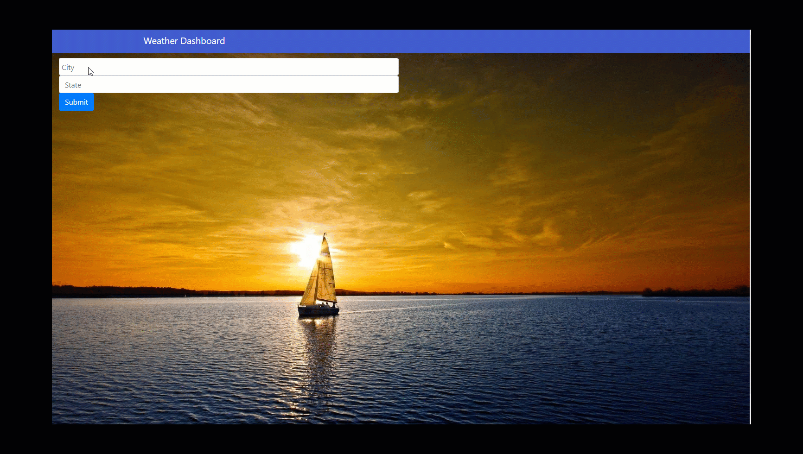

# 06-weather-api

Weather Dashbaord
Site link https://bowdwin.github.io/06-weather-api/
## About / Synopsis
* This is the 6th home work assignment.
* Simple weather dashboard 
* How the calendar works :
    * uses open weather api and pulls in 1 day and 5 day forcast as well as uv, uses 3 api's
    * User enters state and city and items are pushed to local storage and a button is populated for history
    * If page is reloaded, the history returns for last search
      
* Project status: working/prototype

## Developed using
    * HTML
    * CSS
    * Java Script
    * Boostrap
    * open weather API
## GIF shot of "Weather Dashboard"

# Background image
* link: https://img.wallpapersafari.com/
